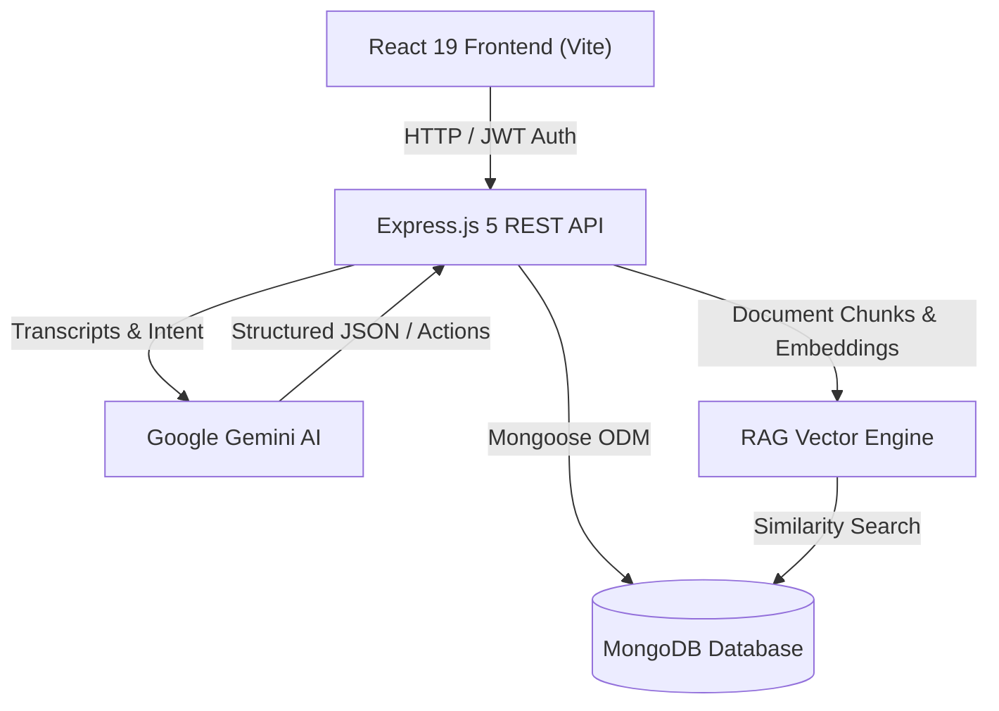
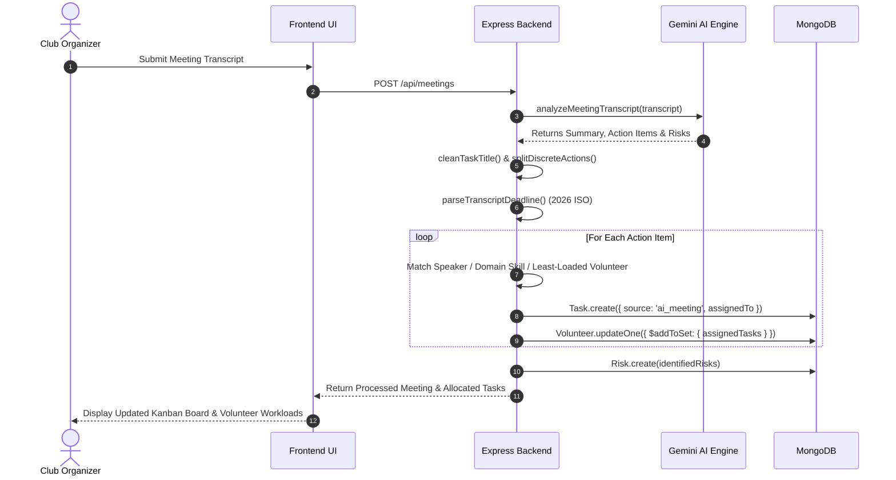

# ⚡ ClubOps-AI

> **Autonomous Club & Event Operations Platform** powered by Google Gemini, Grounded RAG Intelligence, and Multi-Agent Workflows.

[](https://nodejs.org/)
[](https://expressjs.com/)
[](https://react.dev/)
[](https://vitejs.dev/)
[](https://www.mongodb.com/)
[](https://ai.google.dev/)
[](https://opensource.org/licenses/MIT)

---

## 📌 Executive Overview

Organizing university clubs, hackathons, and technical symposiums is traditionally fragmented across disparate spreadsheets, messaging channels, and meeting notes. Critical decisions get buried in transcripts, volunteer workloads become unbalanced, deadlines slip, and club knowledge is lost semester after semester.

**ClubOps-AI** transforms student organization operations into a unified, intelligent command center:
1. **AI-Assisted Event Planning**: Generates end-to-end execution blueprints (venues, timelines, budgets, and milestone tasks) with 1-click database deployment.
2. **Transcript Intelligence & Auto-Allocation**: Parses meeting transcripts or notes, splits multi-sentence action items, assigns 4-tier urgency ratings, and automatically balances task assignments across event volunteers.
3. **Risk Analysis**: Detects operational bottlenecks, contractual damage bonds, and technical failure points, categorizing them with severity ratings and mitigation actions.
4. **Grounded RAG Knowledge Base**: Ingests multi-format club documents (`.pdf`, `.docx`, `.doc`, `.txt`) and answers queries with strict verbatim citations to prevent AI hallucination.
5. **Autonomous AI Agent**: Executes live platform actions (task creation, status progression, risk logging, and team-wide broadcasts) through natural-language conversation.

---

## 🎯 Deliverables & Core Features

### 1. 🎪 AI-Assisted Event Planning
- **Interactive Planner**: Enter an event concept or choose presets (*AI Hackathon*, *Robotics Expo*, *Career Fair*).
- **Comprehensive Blueprints**: Generates recommended venues, 4-phase timelines (Preparation, Build & Logistics, Execution Day, Post-Mortem), estimated budget allocations, milestone tasks, and volunteer roles.
- **1-Click Deployment**: Directly instantiates the planned event in MongoDB with all milestone tasks assigned and synchronized.
- **Agent Integration**: Natural language event planning via the conversational AI agent (`"Plan a robotics symposium for 120 attendees next month"`).

### 2. ✅ Task & Volunteer Management
- **Task Lifecycle**: Full status progression (`pending` $\to$ `in_progress` $\to$ `completed`) with 4-tier priority tagging (`CRITICAL`, `HIGH`, `MEDIUM`, `LOW`).
- **Dynamic Volunteer Workload Balancing**: Real-time tracking of active volunteers, availability status, skills, and current task counts.
- **Skill-Based Auto-Routing**: Automatically matches tasks to domain-specialized teams:
  - *Audio, microphones, stage lighting, projectors* $\to$ **Stage & AV Team**
  - *Loading bays, perimeter security, arena netting* $\to$ **Logistics & Security Team**
  - *Dietary numbers, vegan lunch boxes, speaker travel* $\to$ **Hospitality Team**
  - *NFC badges, registration desk, lanyards* $\to$ **Registration Team**
- **Least-Loaded Allocation**: Routes unassigned tasks to available volunteers with the lowest active task count.

### 3. 🎙️ Meeting Transcript Processing & Action Item Extraction
- **Atomic Statement Splitting**: Breaks long conversational sentences into discrete, actionable tasks.
- **Noise Reduction**: Strips conversational chatter (*"David Kim, please check..."*, *"Lucas: I will handle..."*) into clean, professional task titles.
- **2026-Aware Deadline Parsing**: Converts relative expressions (*"by this Friday at 5 PM"*) into exact, calendar-accurate ISO dates.
- **Idempotent Analysis**: Re-running transcript analysis updates existing records without generating duplicate tasks.

### 4. 🛡️ Risk Identification & Explanation
- **Extraction & Categorization**: Analyzes discussions for operational, financial, and logistical vulnerabilities.
- **Severity Rating**: Classifies risks into `HIGH`, `MEDIUM`, or `LOW` with clear impact explanations.
- **Mitigation Blueprints**: Recommends concrete action steps stored directly in the central Risk Registry.

### 5. 📚 Multi-Format Document Knowledge Base & Grounded RAG
- **Format Support**: Ingests `.pdf`, `.docx`, `.doc`, and `.txt` documents.
- **Chunking & Vector Search**: Generates content embeddings and performs cosine similarity retrieval over document chunks.
- **Grounded Answers**: The RAG engine answers user queries with strict source attribution and citations.
- **Document Inspector**: Built-in viewer modal displaying document text, character count, and word count statistics.

### 6. 📢 Announcements & Team Communication
- **Urgent Broadcasts**: The AI Agent broadcasts alerts to volunteers or entire clubs based on conversational commands.
- **Notification Center**: Real-time notifications with unread badges, timestamps, and priority indicators.

### 7. 🤖 Autonomous AI Agent Workflows
The AI Agent interprets user intent and executes live mutations across the database using 6 dedicated tools:
- `createTask`: Schedules new tasks with assignees, priorities, and deadlines.
- `updateTask`: Modifies task details or transitions status to `completed`.
- `createRisk`: Logs risks with severity and mitigation plans into the risk registry.
- `sendNotification`: Broadcasts urgent messages and announcements to team members.
- `queryKnowledge`: Queries club documents through the Grounded RAG engine.
- `planEvent`: Synthesizes full event plans with venues, timelines, and tasks.

---

## 🏗️ Architecture & Workflows

### System Architecture


### Meeting Transcript Auto-Allocation Flow


---

## 📁 Repository Structure

```text
ClubOps-AI/
├── backend/
│   ├── ai/
│   │   └── agent/
│   │       ├── agent.js              # Autonomous AI agent runner
│   │       ├── intentParser.js       # Rule-based & LLM intent parser
│   │       ├── toolRegistry.js       # Tool registry mapping
│   │       └── tools/                # Executable application tools
│   │           ├── createTask.js
│   │           ├── updateTask.js
│   │           ├── createRisk.js
│   │           ├── planEvent.js
│   │           ├── queryKnowledge.js
│   │           └── sendNotification.js
│   ├── config/
│   │   └── db.js                     # MongoDB Mongoose connection
│   ├── controllers/                  # Express route controllers
│   ├── middleware/                   # JWT auth & role validation
│   ├── models/                       # Mongoose schemas (Event, Task, Risk, etc.)
│   ├── rag/                          # Document chunking, loader, & retrieval
│   ├── routes/                       # API route definitions
│   ├── scripts/
│   │   ├── seed.js                   # Comprehensive database seeder
│   │   └── autoDemo.js               # Autonomous end-to-end verification script
│   ├── services/
│   │   ├── aiService.js              # Gemini prompt engineering & fallbacks
│   │   └── ragService.js             # Vector search & grounded citations
│   ├── server.js                     # Express application entrypoint
│   └── package.json
│
├── frontend/
│   ├── src/
│   │   ├── components/               # Navbar, Sidebar, TaskCard, RiskCard, etc.
│   │   ├── context/                  # AuthContext & EventContext
│   │   ├── layouts/                  # DashboardLayout
│   │   ├── pages/                    # Dashboard, Events, Tasks, Volunteers, etc.
│   │   ├── services/                 # Axios API wrappers
│   │   ├── utils/                    # Storage and formatting utilities
│   │   ├── App.jsx                   # React Router routing configuration
│   │   └── App.css                   # Modern brutalist editorial design system
│   ├── vite.config.js
│   └── package.json
└── README.md
```

---

## 🚀 Quickstart & Setup

### Prerequisites
- **Node.js**: `v18.0.0` or later
- **npm**: `v9.0.0` or later
- **MongoDB**: Local instance running on `localhost:27017` or MongoDB Atlas URI
- **Google Gemini API Key**: [Get an API Key](https://aistudio.google.com/)

---

### 1. Clone the Repository
```bash
git clone https://github.com/Kpanchal1210/ClubOps-AI.git
cd ClubOps-AI
```

---

### 2. Backend Setup

```bash
cd backend
npm install
```

Create a `.env` file in the `backend/` directory:
```env
PORT=5002
MONGO_URI=mongodb://localhost:27017/clubops
JWT_SECRET=your_super_secret_jwt_key_12345
GEMINI_API_KEY=your_google_gemini_api_key
```

Seed the database with sample events, volunteers, tasks, and RAG documents:
```bash
npm run seed
```

Start the backend server:
```bash
npm run dev
# or: npm start
```
*Backend will be running on `http://localhost:5002`.*

---

### 3. Frontend Setup

In a new terminal window:
```bash
cd frontend
npm install
npm run dev
```
*Frontend will be accessible at `http://localhost:5173`.*

---

## 🔑 Demo Credentials

After running `npm run seed`, log in with the default administrator account:

| Attribute | Value |
| :--- | :--- |
| **Email** | `organizer@clubops.org` |
| **Password** | `password123` |
| **Role** | `Organizer / Club Admin` |
| **Club** | `Google Developer Student Club (GDSC)` |

---

## 🌐 API Reference

### Authentication & Users
| Method | Endpoint | Description |
| :--- | :--- | :--- |
| `POST` | `/api/auth/register` | Register a new user account |
| `POST` | `/api/auth/login` | Authenticate and obtain JWT token |
| `GET` | `/api/auth/me` | Retrieve profile of the authenticated user |

### Event Operations
| Method | Endpoint | Description |
| :--- | :--- | :--- |
| `GET` | `/api/events` | List all events for the current club context |
| `POST` | `/api/events` | Create a new event manually |
| `POST` | `/api/events/ai-plan` | **Generate AI Event Blueprint** (timelines, venues, tasks) |
| `GET` | `/api/events/:id` | Retrieve event details with populated references |
| `GET` | `/api/events/:id/dashboard` | Retrieve aggregated dashboard statistics |

### Tasks & Volunteers
| Method | Endpoint | Description |
| :--- | :--- | :--- |
| `GET` | `/api/events/:eventId/tasks` | Get all tasks for an event with priority filters |
| `POST` | `/api/tasks` | Create a new task manually |
| `PATCH` | `/api/tasks/:id` | Update task status, priority, or assignee |
| `GET` | `/api/events/:eventId/volunteers` | List registered volunteers, skills, and assigned task counts |
| `POST` | `/api/volunteers` | Register a new volunteer for an event |

### Meetings & Transcripts
| Method | Endpoint | Description |
| :--- | :--- | :--- |
| `POST` | `/api/meetings` | **Submit transcript**: Automatically extracts tasks & risks, balances workload |
| `GET` | `/api/events/:eventId/meetings` | List all meeting records for an event |
| `POST` | `/api/meetings/:id/process` | Re-run AI analysis on an existing meeting transcript |

### Grounded RAG & Documents
| Method | Endpoint | Description |
| :--- | :--- | :--- |
| `POST` | `/api/documents/upload` | Upload `.pdf`, `.docx`, `.doc`, or `.txt` document |
| `GET` | `/api/events/:eventId/documents` | List uploaded documents with status and metadata |
| `POST` | `/api/rag/ask` | **Ask Grounded RAG Intelligence**: Returns cited answers |
| `POST` | `/api/rag/query` | Retrieve matching semantic text chunks |

### AI Agent & Notifications
| Method | Endpoint | Description |
| :--- | :--- | :--- |
| `POST` | `/api/agent/command` | **Execute natural-language autonomous agent command** |
| `GET` | `/api/notifications` | Get notifications for authenticated user |
| `PATCH` | `/api/notifications/:id/read` | Mark a notification as read |

---

## 🧪 Automated Testing & Verification

Run the autonomous end-to-end verification script to validate all 9 deliverables:
```bash
cd backend
npm run demo
```

The script executes an automated pipeline verifying:
1. User authentication & club retrieval.
2. Event planning synthesis via Google Gemini.
3. Transcript analysis with multi-action splitting and workload balancing.
4. Document indexing over `.pdf` and `.docx` files.
5. Grounded RAG question-answering with exact source citations.
6. Multi-tool autonomous agent commands.

---

## 🛡️ Security & Privacy

- **JWT Authentication**: Passwords hashed using `bcryptjs` with salt rounds.
- **RBAC**: Role-based access control protecting administrative endpoints.
- **Input Sanitization**: File uploads restricted by extension and MIME type via `multer`.
- **Validation Guardrails**: AI actions are validated against backend schemas prior to any database mutation.

---

## 📄 License

This project is licensed under the [MIT License](LICENSE).
